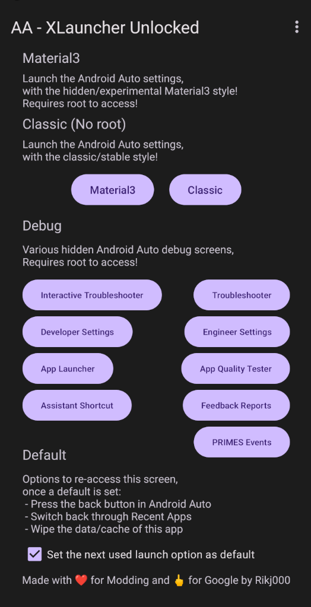

# Android Auto - XLauncher Unlocked (AAXLU)

         

Custom Android Auto launcher, unleash your AA app, unlock more features!

## Installation

#### MicroG Devices
[`aaxlu`](https://github.com/Rikj000/Android-Auto-XLauncher-Unlocked) comes pre-included with [`aa4mg`](https://github.com/sn-00-x/aa4mg)!

#### Other Devices
1. Install [Magisk](https://topjohnwu.github.io/Magisk/install.html)
2. Magisk => Settings => Magisk => Check `Zygisk`
3. Install [LSPosed (Zygisk) + Shamiko](https://lsposed.org/)
4. Install the [Android-Auto-XLauncher-Unlocked](https://github.com/Rikj000/Android-Auto-XLauncher-Unlocked/releases) app with [KingInstaller](https://github.com/fcaronte/KingInstaller)
5. LSPosed => Modules => Check `Enable module` + Check `Android Auto`
6. Reboot

## Features

| Name | Description | Root required | Xposed required |
| :--- | ----------- | :-----------: | :-------------: |
| Default | Set the next used launch option as default | ❌ | ❌ |
| Classic | Launch the Android Auto settings, with the classic/stable style | ❌ | ❌ |
| Material3 | Launch the Android Auto settings, with the hidden/experimental Material3 style | ✔️ | ❌ |
| Debug | Launch various hidden Android Auto debug screens | ✔️ | ❌ |
| Xposed Module | Unlock more 3th party Android Auto apps! *(e.g. Fermata, OsmAnd, S2A, ...)* | ✔️ | ✔️ |

## Description

XLauncher Unlocked is a separate app, to unlock more features in your Android Auto app.

It can launch existing / hidden Android Auto screens with root / ADB commands.   
Classic can be launched without root.

If using the Xposed module,   
then it will also hook into an existing Android Auto function,   
to run some additional code behind it,   
to make some of the "installed as Google Play" checks always come back as valid,   
which does not modify the AA app itself.

Due to the nature of the implementation of the features,   
you should not have to be afraid of "having to wipe AA data to test".   
Because no AA data is touched / no AA files are edited in a persistent way.

## Default "launch option"

The "Set the next used launch option as default" check-mark can be used to   
automatically launch the "launch option" behind the button you click after checking the check-mark.

After a default "launch option" is configured, the next times you open XLauncher Unlocked,   
it will automatically open that "launch option" for you.

This works for every "launch option" (Classic, Material3, Debug options),   
and can easily be re-configured by selecting another "launch option" with the check-mark still configured.

Clearing/resetting the usage of the default "launch option" is as easy as un-checking the check-mark

## Honorable mentions

Check out:

| Software | Description | Root required |
| :------- | ----------- | :-----------: |
| [aa4mg](https://github.com/sn-00-x/aa4mg) | Android Auto for MicroG! | ✔️ |
| [AA-AIO-Tweaker](https://github.com/shmykelsa/AA-Tweaker) | More AA modding through `phenotype.db` patching! | ✔️ |
| [King Installer](https://github.com/fcaronte/KingInstaller) | Install any single `.apk`s for AA "as Google Play" to work around restrictions! | Optional |
| [AA-Store](https://github.com/croccio/Android-Auto-Store) | Install popular 3th party AA apps | ❌ |
| [AAAD](https://github.com/shmykelsa/AAAD) | Install popular 3th party AA apps | ❌ |
| [AAEase](https://inceptive.ru/projects/aaease) | Install a few popular 3th party AA apps | Optional |

## Sources
Credits for [the hooks](https://github.com/AndreyPavlenko/Fermata/commit/f05862f12fa4fe2286c486b6f2adbe09c3e993ce#diff-01877b9e81e32d728d1e9e85e26c85cdfba52fd59010025785236ba117c3633c) from [Fermata](https://github.com/AndreyPavlenko/Fermata) by @AndreyPavlenko!
